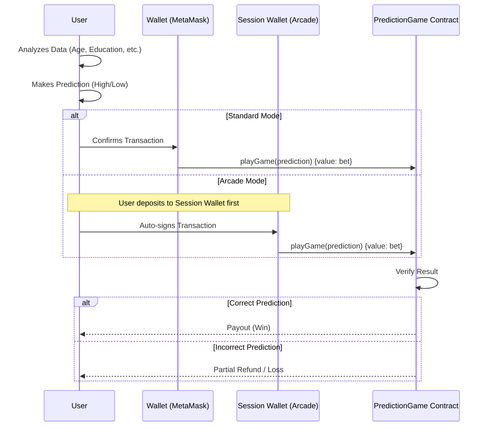

# 🎲 STAKE: The Data Prediction Game

> **Predict. Win. Repeat.**  
> A high-speed Web3 prediction market built on the Monad Blockchain.


## 📖 Overview

**STAKE** is a minimal, high-frequency prediction game where players analyze real-time demographic data to predict income levels. Built for speed and simplicity, it leverages the **Monad Blockchain** to offer instant settlements and transparent payouts.

Players are presented with 5 key demographic features (e.g., Age, Education, Occupation) and must predict within 10 seconds whether the individual's income is **≤ 50K** or **> 50K**.

## ✨ Features

- **⚡ Instant Settlement**: All bets are settled immediately on-chain in a single transaction.
- **🕹️ Arcade Mode**: Enable "Fast Betting" using a session wallet to skip repeated wallet approvals.
- **📊 Real-time Data**: constant stream of demographic puzzles to solve.
- **🔒 Secure & Transparent**: Game logic is fully verified on the Monad explorer.
- **🌑 Dark Mode UI**: sleek, cyberpunk-inspired interface for extended gaming sessions.

## 🏗️ Architecture

STAKE uses a direct-to-contract architecture for maximum speed.



## 🚀 Getting Started

### Prerequisites

- [Node.js](https://nodejs.org/) (v14+)
- [Hardhat](https://hardhat.org/)
- MetaMask installed in browser

### Installation

1.  **Clone the repository**
    ```bash
    git clone https://github.com/yourusername/haacks8_data_game.git
    cd haacks8_data_game
    ```

2.  **Install dependencies**
    ```bash
    npm install
    ```

3.  **Configure Environment**
    Create a `.env` file in the root directory:
    ```ini
    PRIVATE_KEY=your_private_key_here
    ```

4.  **Compile Contracts**
    ```bash
    npx hardhat compile
    ```

### Running Locally

1.  Start a local Hardhat node (optional for testing):
    ```bash
    npx hardhat node
    ```

2.  Deploy contracts:
    ```bash
    npx hardhat run scripts/deploy.js --network localhost
    ```
    *(Note: For Monad Testnet, use `--network monad`)*

3.  Serve the frontend:
    You can use any static file server, for example `serve`:
    ```bash
    npx serve frontend
    ```
    Or simply open `frontend/index.html` in your browser.

## 🎮 How to Play

1.  **Connect Wallet**: Click the "Connect Wallet" button to link your MetaMask.
2.  **Analyze**: Look at the data card showing demographic stats.
3.  **Bet**: Enter your wager amount (in MON).
4.  **Predict**: Choose **Income ≤ 50K** or **Income > 50K**.
5.  **Win**: If you're right, the contract sends your winnings instantly!

## 🔧 Configuration

The game is currently configured for **Monad Testnet**.
- **RPC URL**: `https://testnet-rpc.monad.xyz`
- **Chain ID**: `10143` (0x279f)

## 📄 License

This project is licensed under the MIT License - see the LICENSE file for details.

---

*Built for the Monad Hackathon 2026. Predict responsibly.*
